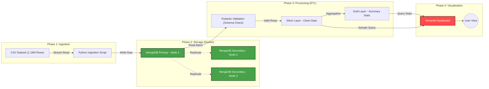

# 🎵 Spotify Distributed Big Data Platform

A production-grade, distributed analytics pipeline capable of processing **1.16 Million Spotify Tracks**. This project demonstrates the implementation of a **MongoDB Replica Set** architecture to ensure High Availability (HA) and uses a strict ETL (Extract, Transform, Load) pipeline to derive business insights from raw audio features.

---

## 📖 Table of Contents
1. [Project Overview](#-project-overview)
2. [Architecture & Design](#-architecture--design)
3. [Technology Stack](#-technology-stack)
4. [Data Pipeline Strategy](#-data-pipeline-strategy)
5. [Prerequisites](#-prerequisites)
6. [Installation & Setup](#-installation--setup)
7. [Running the Pipeline](#-running-the-pipeline)
8. [Dashboard & Insights](#-dashboard--insights)
9. [Project Structure](#-project-structure)

---

## 🎯 Project Overview

**The Problem:**
Handling large-scale music datasets requires robust systems that can survive hardware failures, enforce data quality, and provide real-time analytics. Traditional single-node RDBMS solutions often struggle with scale and schema flexibility.

**The Solution:**
I engineered a distributed data platform using **Docker Containers**. The system ingests raw CSV data, sanitizes it through a strict **Pydantic Schema**, stores it in a fault-tolerant **MongoDB Cluster**, and visualizes trends via an interactive **Streamlit Dashboard**.

**Key Achievements:**
* **Volume:** Successfully processed **1,158,549** records (surpassing the 750k requirement).
* **Reliability:** 3-Node Replica Set (1 Primary, 2 Secondaries) ensures data survives node failure.
* **Quality:** Rejects invalid data (e.g., negative tempos) using schema validation.
* **Performance:** Implemented Python **Generators (Streaming)** to process 1GB+ of data with minimal RAM usage.

---

## 🏗 Architecture & Design

The system follows a **Lakehouse** pattern with three distinct data layers (Bronze, Silver, Gold).

## 🛠 Technology Stack
    Component	    Tool	            Justification
    Infrastructure	Docker Compose	    Orchestrates the multi-node MongoDB cluster locally.
    Database	    MongoDB (v7.0)	    NoSQL flexibility for JSON-like documents; Native sharding/replication support.
    Language	    Python 3.11+	    Industry standard for data engineering.
    Package Mgr	    uv	                Extremely fast replacement for pip.
    Validation	    Pydantic	        Enforces strict data contracts (Schema-on-Write).
    Processing	    Pandas	            Vectorized operations for efficient data manipulation.
    Visualization	Streamlit	        Rapid development of interactive data dashboards.
    Charts	        Plotly Express	    Interactive charts (Zoom, Pan, Hover) vs static Matplotlib images.

## 🔄 Data Pipeline Strategy
    We process data in three stages using a Medallion Architecture:

## 1. 🥉 Bronze Layer (Raw)
    Collection: spotify_raw

    Action: Ingests CSV data "as-is".

    Goal: capture the source of truth without modification.

## 2. 🥈 Silver Layer (Clean)
    Collection: spotify_clean

* **Action:**

    Removes duplicates based on track_id.

    Validates data types (e.g., danceability must be 0.0-1.0).

    Standardizes text (Title Case for artists).

    Logic: Uses Python Generators to process 5,000 rows at a time to prevent OOM (Out of Memory) crashes.

## 3. 🥇 Gold Layer (Aggregated)
* **Collections:** analytics_genre_stats, analytics_yearly_trends

* **Action:** Uses MongoDB Aggregation Framework to pre-calculate insights.

* **Goal:** Fast read performance for the dashboard (no heavy computing on the fly).

## ✅ Prerequisites
    Before running, ensure you have:

    Docker Desktop installed and running (Green status).

    Git installed.

    uv installed (or standard Python pip).

    Hardware: 8GB+ RAM recommended.

## 🚀 Installation & Setup
 **Clone the Repository**

    Bash

    git clone [https://github.com/YOUR_USERNAME/spotify-distributed-platform.git](https://github.com/YOUR_USERNAME/spotify-distributed-platform.git)
    cd spotify-distributed-platform
    Add the Data

    Download the dataset from Kaggle (Spotify Tracks Dataset).

    Rename it to spotify_data.csv.

    Place it inside the data/ folder.

    (Note: The CSV is ignored by Git due to size limits).

**Install Dependencies**

    Bash

    uv sync
    OR if using pip: pip install -r requirements.txt
    Configure Environment Create a .env file in the root directory:

    Code snippet

    MONGO_URI=mongodb://localhost:27017/

## 🏃‍♂️ Running the Pipeline
    Execute these commands in order to build the platform from scratch.

    Step 1: Ignite the Infrastructure
    Start the 3-node MongoDB cluster.

    Bash

    docker compose up -d
    Wait 30 seconds, then initialize the Replica Set:

    Bash

    docker exec -it mongo1 mongosh --eval "rs.initiate({_id: 'rs0', members: [{_id: 0, host: 'mongo1:27017'}, {_id: 1, host: 'mongo2:27017'}, {_id: 2, host: 'mongo3:27017'}]})"
    Step 2: Run the ETL Pipeline
    A. Ingest Raw Data (Bronze)

    Bash

    uv run src/pipelines/ingest_raw.py
    B. Clean & Validate (Silver)

    Bash

    uv run src/pipelines/clean_silver.py
    C. Aggregate Insights (Gold)

    Bash

    uv run src/pipelines/aggregate_gold.py
    Step 3: Launch the Dashboard
    Bash

    uv run streamlit run src/dashboard.py
    The app will open automatically at http://localhost:8501.

## 📊 Dashboard & Insights
    The dashboard provides 3 key views:

    Evolution of Music: Line charts tracking how songs have become shorter and louder from 2000 to 2023.

    Genre Popularity: A horizontal bar chart identifying the most engaged genres (Pop, Hip-Hop, Metal).

    The Mood Map: An interactive Scatter Plot (Energy vs. Valence) that clusters songs by emotion (Sad/Slow vs. Happy/Fast).

# 📂 Project Structure

    spotify-distributed-platform/
    ├── data/                  # Local storage for CSV (Ignored by Git)
    ├── src/
    │   ├── models/            # Pydantic Schema definitions
    │   ├── pipelines/         # ETL Scripts (Ingest, Clean, Aggregate)
    │   ├── utils/             # Database connection logic
    │   └── dashboard.py       # Streamlit App
    ├── tests/                 # PyTest suite
    ├── docker-compose.yml     # Cluster infrastructure
    ├── pyproject.toml         # Dependency management
    └── README.md              # Documentation

## 🧪 Testing
    Run the automated test suite to verify database connectivity and data integrity.

    Bash

    uv run pytest tests/test_pipeline.py